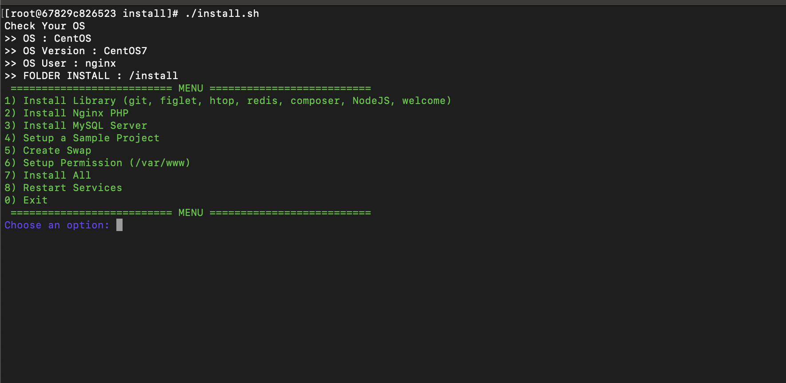
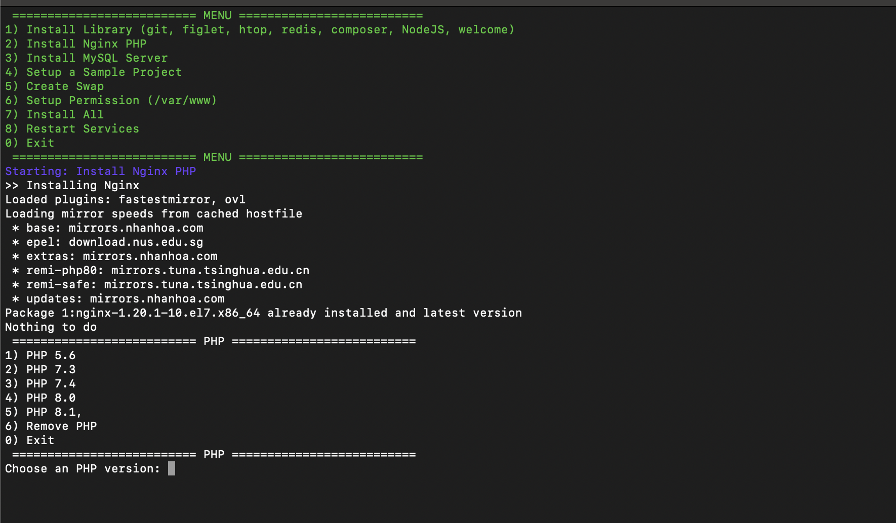

## TEST

Build docker (cpu architecture x86)

Image test - centos7 x86 (google cloud platform) and Amazon Linux 2 (AWS))

```shell
docker-compose up -d --build
```

Exec docker run script

```shell
docker exec -it  -u root centos7-test bash
```

```
#cd install
#chmod +x install
#./install.sh
```


